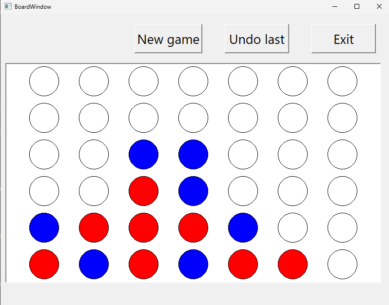

# System wspierający grę planszową – Connect Four
### Autor: Paweł Martyniuk
Praca przedstawia projekt i implementację zaawansowanego bota służącego do gry w grę planszową "Connect Four". Wykorzystując sztuczną inteligencję bot ma na celu wykazywanie się strategicznymi umiejętnościami podejmowania decyzji oraz przystosowywanie się do różnych możliwych scenariuszy gry przewidując poprawne posunięcia.
## Technologia
Program został napisany w języku C++. Interfejs graficzny stworzony przy użyciu bibiloteki QT.
## Możliwe warianty gry
* między dwoma graczami
* gracz kontra komputer - algorytm naiwny
* gracz kontra komputer - algorytm perfekcyjny (na razie działa dla maksymalnej planszy 6x6)

Interfejs gry wygląda następująco:

